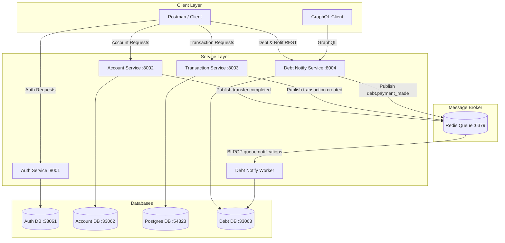
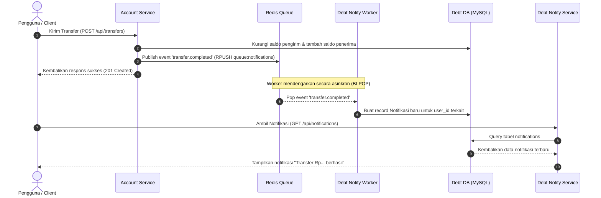

# Debt & Notification Service (P4)

Layanan **debt-notify-service** adalah microservice yang bertanggung jawab untuk pencatatan utang, piutang, riwayat pembayaran utang, serta manajemen notifikasi pengguna dan tips keuangan.

Service ini juga menjalankan **debt-notify-worker** yang mendengarkan event queue Redis secara asinkronus (menggunakan pola `BLPOP` antrean Redis) untuk menghasilkan notifikasi pengguna secara real-time dari service-service lain (seperti *transfer* dari `account-service` atau *transaksi* dari `transaction-service`).

---

## 📊 Arsitektur Sistem & Aliran Data

### 1. Diagram Arsitektur Microservices


### 2. Alur Notifikasi Asinkron (Async Notification Flow)


---

## ⚙️ Spesifikasi Port & Konfigurasi Lingkungan

* **Network**: `keuangan-net` (External bridge network)
* **Ports**:
  * Aplikasi Web (`debt-notify-service`): `8004 -> 8000`
  * Database MySQL (`debt-db`): `33063 -> 3306` (Database: `debt_db`)
  * Background Worker (`debt-notify-worker`): Berjalan di dalam container terpisah tanpa membuka port luar.
* **Environment Variables (`.env`)**:
  ```ini
  APP_NAME=debt-notify-service
  APP_ENV=local
  APP_KEY=base64:m3o+1Lm3xFyQMU3CLlQH2tM+JTgiYOzqaN86R2IvJJg=
  APP_DEBUG=true

  DB_CONNECTION=mysql
  DB_HOST=debt-db
  DB_PORT=3306
  DB_DATABASE=debt_db
  DB_USERNAME=root
  DB_PASSWORD=root

  REDIS_HOST=redis
  REDIS_PORT=6379
  REDIS_CLIENT=predis
  NOTIFICATIONS_QUEUE=queue:notifications
  AUTH_SERVICE_URL=http://auth-service:8000
  ```

---

## 🚀 Panduan Menjalankan Layanan (Docker)

Layanan ini memerlukan `auth-service` dan `account-service` untuk berjalan terlebih dahulu karena mereka menginisialisasi network `keuangan-net` serta container `redis`.

Jalankan perintah berikut di folder `debt-notify-service`:
```bash
# Build dan jalankan container db, service, dan worker
docker compose up -d --build
```

Setelah berjalan, Anda dapat memverifikasi container:
```bash
docker compose ps
```
Anda akan melihat tiga container berjalan:
* `debt-db` (MySQL port `33063`)
* `debt-notify-service` (Laravel web API port `8004`)
* `debt-notify-worker` (Background listener queue Redis)

---

## 📡 Dokumentasi Endpoint REST API

Semua request di bawah ini membutuhkan header `Authorization: Bearer <token>` (didapatkan dari login di `auth-service`) dan `Accept: application/json`.

### 1. Manajemen Utang & Piutang (Debts)

#### **Get All Debts & Receivables**
* **Method**: `GET`
* **URL**: `/api/debts`
* **Response (200 OK)**:
  ```json
  {
      "utang": [...],
      "piutang": [...]
  }
  ```

#### **Create Debt/Receivable**
* **Method**: `POST`
* **URL**: `/api/debts`
* **Payload**:
  ```json
  {
      "deskripsi": "Pinjam uang beli makan",
      "jumlah": 50000,
      "jenis": "utang",
      "pemberi": "Teman Budi",
      "keterangan": "Bayar minggu depan",
      "tanggal": "2026-06-21",
      "jatuh_tempo": "2026-06-28"
  }
  ```
* **Response (210 Created)**

#### **Pay Debt / Receive Payment**
* **Method**: `POST`
* **URL**: `/api/debts/{id}/payments`
* **Payload**:
  ```json
  {
      "jumlah_bayar": 20000
  }
  ```
* **Response (200 OK)**: Melakukan update pengurangan `sisa_jumlah` secara otomatis, mencatat log ke `riwayat_utang`, serta mem-*publish* event `debt.payment_made` ke Redis.

#### **Get Debt Payment History**
* **Method**: `GET`
* **URL**: `/api/debts/{id}/history`
* **Response (200 OK)**: Mengembalikan riwayat pembayaran untuk utang tersebut.

---

### 2. Manajemen Notifikasi & Tips

#### **Get All Notifications**
* **Method**: `GET`
* **URL**: `/api/notifications`
* **Response (200 OK)**: List notifikasi terpaginasi (milik user terautentikasi).

#### **Mark Notification as Read**
* **Method**: `POST`
* **URL**: `/api/notifications/{id}/read`

#### **Delete Notification**
* **Method**: `DELETE`
* **URL**: `/api/notifications/{id}`

#### **Broadcast Notification (Admin Only)**
* **Method**: `POST`
* **URL**: `/api/notifications/broadcast`
* **Payload**:
  ```json
  {
      "title": "Pengumuman Penting",
      "message": "Pemeliharaan server nanti malam jam 23.00.",
      "type": "warning",
      "send_all": true
  }
  ```

#### **Get Financial Tips**
* **Method**: `GET`
* **URL**: `/api/tips`

---

## 🧬 Dokumentasi GraphQL API (`/graphql`)

Endpoint GraphQL dapat diakses pada `POST http://localhost:8004/graphql` dengan melampirkan header token autentikasi.

### 1. Query Debts
```graphql
query {
  debts {
    id
    jenis
    pemberi
    deskripsi
    jumlah
    sisa_jumlah
    status
    riwayat {
      id
      jumlah
      tanggal
      keterangan
    }
  }
}
```

### 2. Mutation PayDebt
```graphql
mutation {
  payDebt(id: 2, jumlah_bayar: 10000) {
    id
    sisa_jumlah
    status
  }
}
```

### 3. Query Notifications
```graphql
query {
  notifications {
    id
    title
    message
    type
    read_at
    created_at
  }
}
```

### 4. Mutation MarkRead
```graphql
mutation {
  markRead(id: 3) {
    id
    read_at
  }
}
```

---

## 📬 Postman Collection
Anda dapat menggunakan file [debt.postman_collection.json](./debt.postman_collection.json) yang tersedia di folder ini untuk menguji semua fungsi di atas secara langsung melalui aplikasi Postman. 
* Cukup sesuaikan variabel `BASE_URL` ke `http://localhost:8004` dan isi `TOKEN` dengan Bearer token yang valid.
